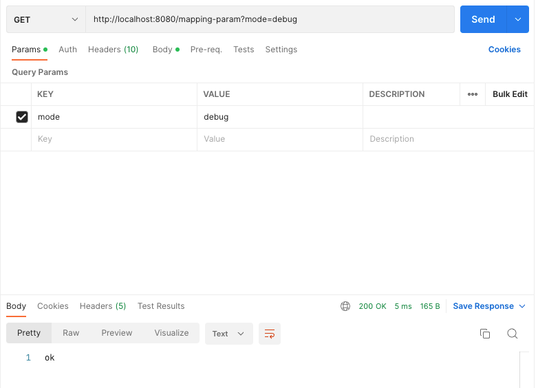
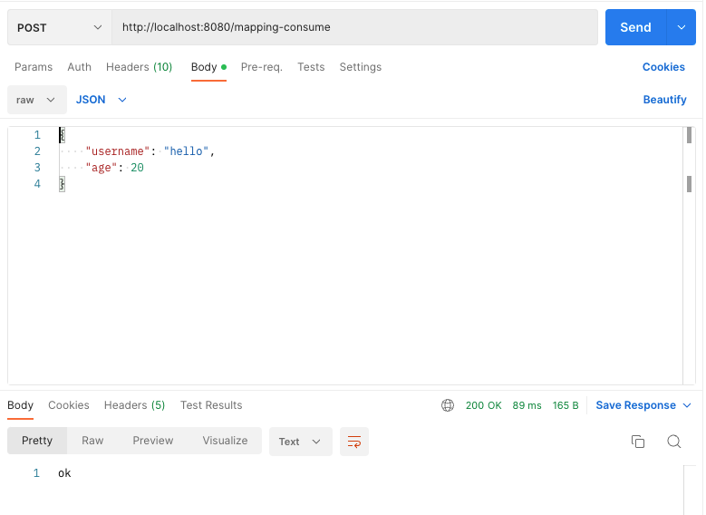
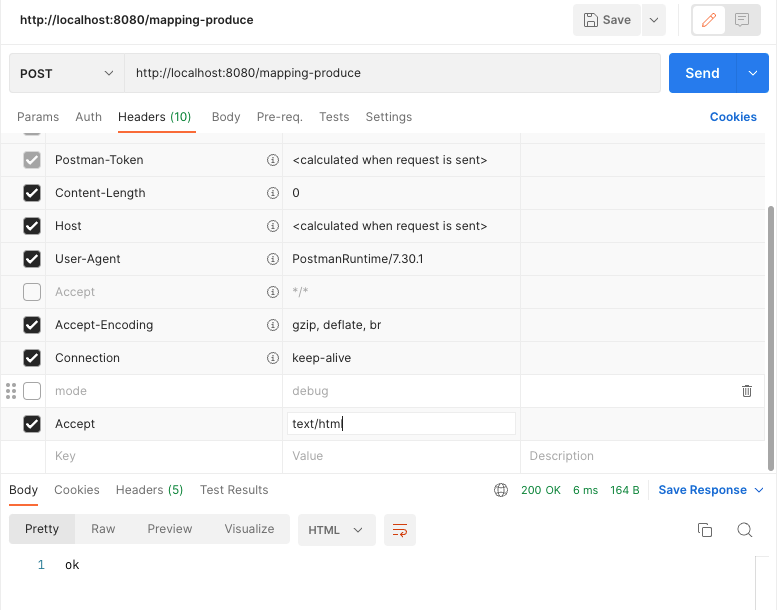

# 스프링 MVC - 기본 기능
## 프로젝트 생성

## 로깅 간단히 알아보기
앞으로 로그를 사용할 것이기 때문에, 이번 시간에는 로그에 대해서 간단히 알아보자.

운영 시스템에는 `System.out.println`같은 시스템 콘솔을 사용해서 필요한 정보를 출력하지 않고,
별도의 로깅 라이브러리를 사용해서 로그를 출력한다.

참고로 로그 관련 라이브러리도 많고, 깊게 들어가면 끝이 없기 때문에, 여기서는 최소한의 사용 방법만 알아본다.

### 로깅 라이브러리
스프링 부트 라이브러리를 사용하면 스프링 부트 로깅 라이브러리(`spring-boot-starter-loggin`)가 함께 포함된다.
스프링 부트 로깅 라이브러리는 기본으로 다음 로깅 라이브러리를 사용한다.

* SLF4J, Logback

로그 라이브러리는 Logback, Log4J, Log4J2 등등 수 많은 라이브러리가 있는데, 그것을 통합해서 인터페이스로 제공하는 것이 바로 SLF4J 라이브러리다.

쉽게 이야기해서 SLF4J는 인터페이스이고, 그 구현체로 Logback 같은 로그 라이브러리를 선택하면 된다.
실무에서는 스프링부트가 기본적으로 제공하는 Logback을 대부분 사용한다.

### 로그 선언
* `private Logger log = LoggerFactory.getLogger(getClass())`
* `private static final Logger log = LoggerFactory.getLogger(Xxx.class)`
* `@Slf4j`: 롬복 사용 가능

### 로그 호출
* `log.info("hello")`
* `System.out.println("hello")`

시스템 콘솔로 직접 출력하는 것 보다 로그를 사용하면 다음과 같은 장점이 있다.
실무에서는 항상 로그를 사용해야 한다.

### LogTestController
```java
@RestController
public class LogTestController {
    private final Logger log = LoggerFactory.getLogger(getClass());

    @RequestMapping("/log-test")
    public String logTest() {
        String name = "Spring";

        log.trace("trace log = {}", name);
        log.debug("debug log = {}", name);
        log.info("info log = {}", name);
        log.warn("warn log = {}", name);
        log.error("error log = {}", name);

        // 로그를 사용하지 않아도 a + b 계산 로직이 먼저 실행됨, 이런 방식으로 사용하면 X
        // log.debug("String concat log = " + name);

        return "ok";
    }
}
```

### 매핑 정보
* `@RestController`
  * `@Controller`는 반환 값이 `String`이면 뷰 이름으로 인식된다. 그래서 뷰를 찾고 뷰가 렌더링 된다.
  * `@RestController`는 반환 값으로 뷰를 찾는 것이 아니라, HTTP 메시지 바디에 바로 입력한다.
    따라서 실행 결과로 ok 메시지를 받을 수 있다. `@ResponseBody`와 관련이 있는데, 뒤에서 더 자세히 설명한다.

### 테스트
* 로그가 출력되는 포멧 확인
  * 시간, 로그 레벨, 프로세스 ID, 쓰레드 명, 클래스명, 로그 메시지
* 로그 레벨 설정을 변경해서 출력 결과를 보자
  * LEVEL: `TRACE > DEBUG > INFO > WARN > ERROR`
* `@Slf4j`로 변경

### 로그 레벨 설정
`application.properties`
```properties
# 전체 로그 레벨 설정 ( 기본 info )
logging.level.root=info

# hello.springmvc 패키지와 그 하위 로그 레벨 설정
logging.level.hello.springmvc=trace
```

### 올바른 로그 사용법
* `log.debug("data = " + data);`
  * 로그 출력 레벨을 info로 설정해도 해당 코드에 있는 `"data="+data` 가 실제 실행이 되어 버린다.
* `log.debug("data = {}, data);`
  * 로그 출력 레벨을 info로 설정하면 아무일도 발생하지 않는다.

### 로그 사용시 장점
* 쓰레드 정보, 클래스 이름 같은 부가 정보를 함께 볼 수 있고, 출력 모양을 조정할 수 있다.
* 로그 레벨에 따라 개발 서버에서는 모든 로그를 출력하고, 운영 서버에서는 출력하지 않는 등 로그를 상황에 맞게 조절할 수 있다.
* 시스템 아웃 콘솔에만 출력하는 것이 아니라, 파일이나 네트워크 등, 로그를 별도의 위치에 남길 수 있다.
  특히 파일로 남길 때는 일별, 특정 용량에 따라 로그를 분할하는 것도 가능하다.
* 성늘도 일단 `System.out`보다 좋다. (내부 버퍼링, 멀티 쓰레드 등등)
  그래서 실무에서는 꼭 로그를 사용해야 한다.

### 더 공부하실 분
* 로그에 대해서 더 자세한 내용은 slf4j, logback을 검색해보자.
  * SLF4J: http://www.slf4j.org/
  * Logback: http://logback.qos.ch/
* 스프링 부트가 제공하는 로그 기능은 다음을 참고하자
  * https://docs.spring.io/spring-boot/docs/current/reference/html/features.html#features.logging

## 요청 매핑
### MappingController
```java
@Slf4j
@RestController
public class MappingController {
    @RequestMapping("/hello-basic")
    public String helloBasic() {
        log.info("helloBasic");
        return "ok";
    }
}
```

### 매핑 정보
* `@RestController`
  * `@Controller`는 반환값이 `String`이면 뷰 이름으로 인식한다. 그래서 뷰를 찾고 뷰가 렌더링된다.
  * `@RestController`는 반환 값으로 뷰를 찾는 것이 아니라, HTTP 메시지 바디에 바로 입력한다.
* `@RequestMapping("/hello-basic")`
  * `/hello-basic` URL 호출이 오면 이 메서드가 실행되도록 매핑한다.
  * 대부분의 속성을 배열로 제공하므로 다중 설정이 가능하다.
    * `{"/hello-basic", "/hello-go"}`

### HTTP 메서드
`@RequestMapping`에 `method`속성으로 HTTP 메서드를 지정하지 않으면 HTTP 메서드와 무관하게 호출된다.

### HTTP 메서드 매핑
```java
@Slf4j
@RestController
public class MappingController {
  /**
   * method 특정 HTTP 메서드 요청만 허용
   * GET, HEAD, POST, PUT, PATCH, DELETE
   */
  @RequestMapping(value = "/mapping-get-v1", method = RequestMethod.GET)
  public String mappingGetV1() {
    log.info("mappingGetV1");
    return "ok";
  }
}
```
만약, 여기에 POST 요청을 하면 스프링 MVC는 HTTP 405 상태코드를 반환한다.

### HTTP 메서드 매핑 축약
```java
@Slf4j
@RestController
public class MappingController {
  /**
   * 편리한 축약 애노테이션 (코드보기)
   * @GetMapping
   * @PostMapping
   * @PutMapping
   * @DeleteMapping
   * @PatchMapping
   */
  @GetMapping(value = "/mapping-get-v2")
  public String mappingGetV2() {
    log.info("mappingGetV2");
    return "ok";
  }
}
```
HTTP 메서드를 축약한 애노테이션을 사용하는 것이 더 직관적이다.
코드를 보면 내부에서 `@RequestMapping`과 `method`를 지정해서 사용하는 것을 확인할 수 있다.

### PathVariable(경로 변수) 사용
```java
@Slf4j
@RestController
public class MappingController {
  /**
   * PathVariable 사용
   * 변수명이 같으면 생략 가능
   * @PathVariable("userId") String userId -> @PathVariable userId
   */
  @GetMapping("/mapping/{userId}")
  public String mappingPath(
          @PathVariable("userId") String data
  ) {
    log.info("mappingPath userId={}", data);
    return "ok";
  }
}
```

최근 HTTP API는 다음과 같이 리소스 경로에 식별자를 넣는 스타일을 선호한다.
* `/mapping/userA`
* `/users/1`

* `@RequestMapping`은 URL 경로를 템플릿화 할 수 있는데, `@PathVariable`을 사용하면 매칭 되는 부분을 편리하게 조회할 수 있다.
* `@PathVariable`의 이름과 파라미터 이름이 같으면 생략할 수 있다.

### PathVariable 사용 - 다중
```java
@Slf4j
@RestController
public class MappingController {
  /**
   * PathVariable 사용 다중
   */
  @GetMapping("/mapping/{userId}/orders/{orderId}")
  public String mappingMultiPath(
          @PathVariable String userId,
          @PathVariable Long orderId
  ) {
    log.info("mappingMultiPath userId={} orderId={}", userId, orderId);
    return "ok";
  }
}
```

### 특정 파라미터 조건 매핑
```java
@Slf4j
@RestController
public class MappingController {
  /**
   * 파라미터로 추가 매핑
   * params="mode",
   * params="!mode"
   * params="mode=debug"
   * params="mode!=debug"
   * params={"mode=debug","data=good"}
   */
  @GetMapping(value = "/mapping-param", params = "mode=debug")
  public String mappingParam() {
    log.info("mappingParam");
    return "ok";
  }
}
```


### 특정 헤더 조건 매핑
```java
@Slf4j
@RestController
public class MappingController {
  /**
   * 특정 헤더로 추가 매핑
   * headers="mode",
   * headers="!mode"
   * headers="mode=debug"
   * headers="mode!=debug"
   */
  @GetMapping(value = "/mapping-header", headers = "mode=debug")
  public String mappingHeader() {
    log.info("mappingHeader");
    return "ok";
  }
}
```


### 미디어 타입 조건 매핑 - HTTP 요청 Content-Type, consume
```java
@Slf4j
@RestController
public class MappingController {
  /**
   * Content-Type 헤더 기반 추가 매핑 Media Type
   * consumes="application/json"
   * consumes="!application/json"
   * consumes="application/*"
   * consumes="*\/*"
   * MediaType.APPLICATION_JSON_VALUE
   */
  @PostMapping(value = "/mapping-consume", consumes = "application/json")
  public String mappingConsumes() {
    log.info("mappingConsumes");
    return "ok";
  }
}
```


### 미디어 타입 조건 매핑 - HTTP 요청 Accept, produce
```java
@Slf4j
@RestController
public class MappingController {
  /**
   * Accept 헤더 기반 Media Type
   * produces = "text/html"
   * produces = "!text/html"
   * produces = "text/*"
   * produces = "*\/*"
   */
  @PostMapping(value = "/mapping-produce", produces = "text/html")
  public String mappingProduces() {
    log.info("mappingProduces");
    return "ok";
  }
}
```


## 요청 매핑 - API 예시
회원 관리를 HTTP API로 만든다 생각하고 매핑을 어떻게 하는지 알아보자.

### 회원 관리 API
* 회원 목록 조회: GET `/users`
* 회원 등록: POST `/users`
* 회원 조회: GET `/users/{userId}`
* 회원 수정: PATCH `/users/{userId}`
* 회원 삭제: DELETE `/users/{userId}`

### MappingClassController
```java
@RestController
@RequestMapping("/mapping/users")
public class MappingClassController {
    /**
     * GET /mapping/users
     */
    @GetMapping
    public String user() {
        return "get users";
    }

    /**
     * POST /mapping/users
     */
    @PostMapping
    public String addUser() {
        return "post user";
    }

    /**
     * GET /mapping/users/{userId}
     */
    @GetMapping("/{userId}")
    public String findUser(
            @PathVariable String userId
    ) {
        return "get userId = " + userId;
    }

    /**
     * PATCH /mapping/users/{userId}
     */
    @PatchMapping("/{userId}")
    public String updateUser(
            @PathVariable String userId
    ) {
        return "update userId = " + userId;
    }

    /**
     * DELETE /mapping/users/{userId}
     */
    @DeleteMapping("/{userId}")
    public String deleteUser(
            @PathVariable String userId
    ) {
        return "delete userId = " + userId;
    }
}
```

## HTTP 요청 - 기본, 헤더 조회

## HTTP 요청 파라미터 - 쿼리 파라미터, HTML Form

## HTTP 요청 파라미터 - @RequestParam

## HTTP 요청 파라미터 - @ModelAttribute

## HTTP 요청 메시지 - 단순 텍스트

## HTTP 요청 메시지 - JSON

## 응답 - 정적 리소스, 뷰 템플릿

## HTTP 응답 - HTTP API, 메시지 바디에 직접 입력

## HTTP 메시지 컨버터

## 요청 매핑 헨들러 어뎁터 구조

## 정리
