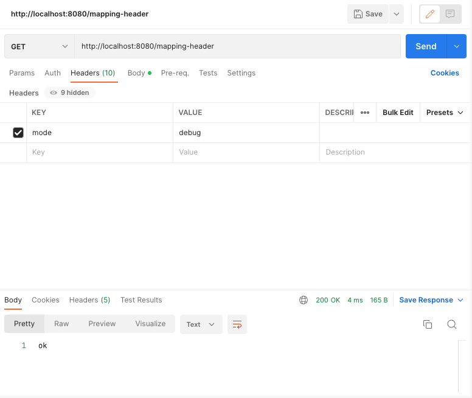
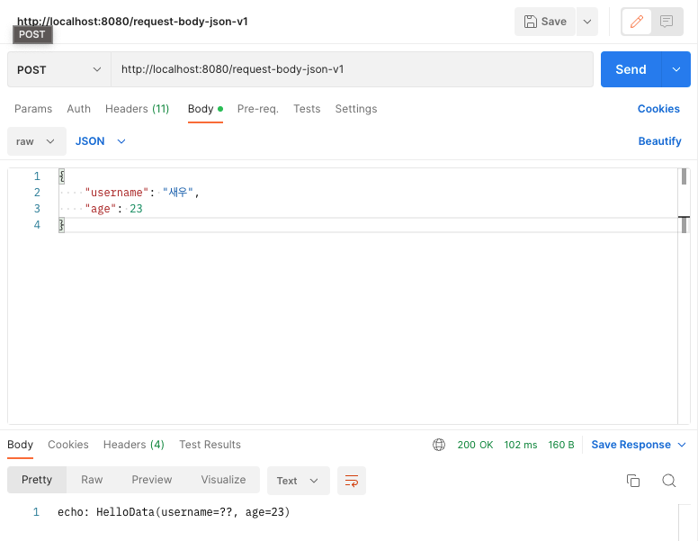
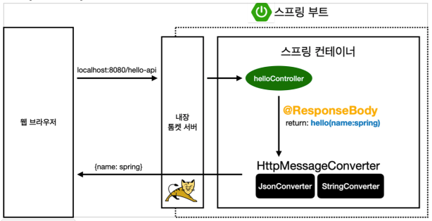
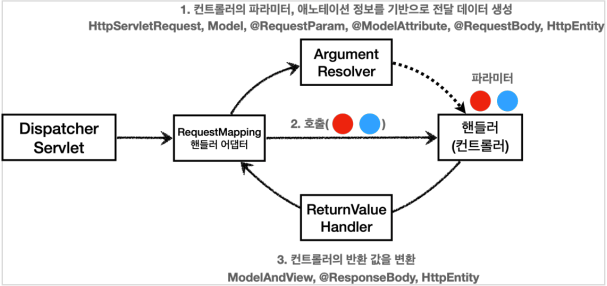
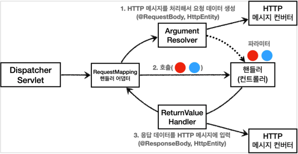

# 스프링 MVC - 기본 기능
## 프로젝트 생성

## 로깅 간단히 알아보기
앞으로 로그를 사용할 것이기 때문에, 이번 시간에는 로그에 대해서 간단히 알아보자.

운영 시스템에는 `System.out.println`같은 시스템 콘솔을 사용해서 필요한 정보를 출력하지 않고,
별도의 로깅 라이브러리를 사용해서 로그를 출력한다.

참고로 로그 관련 라이브러리도 많고, 깊게 들어가면 끝이 없기 때문에, 여기서는 최소한의 사용 방법만 알아본다.

### 로깅 라이브러리
스프링 부트 라이브러리를 사용하면 스프링 부트 로깅 라이브러리(`spring-boot-starter-loggin`)가 함께 포함된다.
스프링 부트 로깅 라이브러리는 기본으로 다음 로깅 라이브러리를 사용한다.

* SLF4J, Logback

로그 라이브러리는 Logback, Log4J, Log4J2 등등 수 많은 라이브러리가 있는데, 그것을 통합해서 인터페이스로 제공하는 것이 바로 SLF4J 라이브러리다.

쉽게 이야기해서 SLF4J는 인터페이스이고, 그 구현체로 Logback 같은 로그 라이브러리를 선택하면 된다.
실무에서는 스프링부트가 기본적으로 제공하는 Logback을 대부분 사용한다.

### 로그 선언
* `private Logger log = LoggerFactory.getLogger(getClass())`
* `private static final Logger log = LoggerFactory.getLogger(Xxx.class)`
* `@Slf4j`: 롬복 사용 가능

### 로그 호출
* `log.info("hello")`
* `System.out.println("hello")`

시스템 콘솔로 직접 출력하는 것 보다 로그를 사용하면 다음과 같은 장점이 있다.
실무에서는 항상 로그를 사용해야 한다.

### LogTestController
```java
@RestController
public class LogTestController {
    private final Logger log = LoggerFactory.getLogger(getClass());

    @RequestMapping("/log-test")
    public String logTest() {
        String name = "Spring";

        log.trace("trace log = {}", name);
        log.debug("debug log = {}", name);
        log.info("info log = {}", name);
        log.warn("warn log = {}", name);
        log.error("error log = {}", name);

        // 로그를 사용하지 않아도 a + b 계산 로직이 먼저 실행됨, 이런 방식으로 사용하면 X
        // log.debug("String concat log = " + name);

        return "ok";
    }
}
```

### 매핑 정보
* `@RestController`
  * `@Controller`는 반환 값이 `String`이면 뷰 이름으로 인식된다. 그래서 뷰를 찾고 뷰가 렌더링 된다.
  * `@RestController`는 반환 값으로 뷰를 찾는 것이 아니라, HTTP 메시지 바디에 바로 입력한다.
    따라서 실행 결과로 ok 메시지를 받을 수 있다. `@ResponseBody`와 관련이 있는데, 뒤에서 더 자세히 설명한다.

### 테스트
* 로그가 출력되는 포멧 확인
  * 시간, 로그 레벨, 프로세스 ID, 쓰레드 명, 클래스명, 로그 메시지
* 로그 레벨 설정을 변경해서 출력 결과를 보자
  * LEVEL: `TRACE > DEBUG > INFO > WARN > ERROR`
* `@Slf4j`로 변경

### 로그 레벨 설정
`application.properties`
```properties
# 전체 로그 레벨 설정 ( 기본 info )
logging.level.root=info

# hello.springmvc 패키지와 그 하위 로그 레벨 설정
logging.level.hello.springmvc=trace
```

### 올바른 로그 사용법
* `log.debug("data = " + data);`
  * 로그 출력 레벨을 info로 설정해도 해당 코드에 있는 `"data="+data` 가 실제 실행이 되어 버린다.
* `log.debug("data = {}, data);`
  * 로그 출력 레벨을 info로 설정하면 아무일도 발생하지 않는다.

### 로그 사용시 장점
* 쓰레드 정보, 클래스 이름 같은 부가 정보를 함께 볼 수 있고, 출력 모양을 조정할 수 있다.
* 로그 레벨에 따라 개발 서버에서는 모든 로그를 출력하고, 운영 서버에서는 출력하지 않는 등 로그를 상황에 맞게 조절할 수 있다.
* 시스템 아웃 콘솔에만 출력하는 것이 아니라, 파일이나 네트워크 등, 로그를 별도의 위치에 남길 수 있다.
  특히 파일로 남길 때는 일별, 특정 용량에 따라 로그를 분할하는 것도 가능하다.
* 성늘도 일단 `System.out`보다 좋다. (내부 버퍼링, 멀티 쓰레드 등등)
  그래서 실무에서는 꼭 로그를 사용해야 한다.

### 더 공부하실 분
* 로그에 대해서 더 자세한 내용은 slf4j, logback을 검색해보자.
  * SLF4J: http://www.slf4j.org/
  * Logback: http://logback.qos.ch/
* 스프링 부트가 제공하는 로그 기능은 다음을 참고하자
  * https://docs.spring.io/spring-boot/docs/current/reference/html/features.html#features.logging

## 요청 매핑
### MappingController
```java
@Slf4j
@RestController
public class MappingController {
    @RequestMapping("/hello-basic")
    public String helloBasic() {
        log.info("helloBasic");
        return "ok";
    }
}
```

### 매핑 정보
* `@RestController`
  * `@Controller`는 반환값이 `String`이면 뷰 이름으로 인식한다. 그래서 뷰를 찾고 뷰가 렌더링된다.
  * `@RestController`는 반환 값으로 뷰를 찾는 것이 아니라, HTTP 메시지 바디에 바로 입력한다.
* `@RequestMapping("/hello-basic")`
  * `/hello-basic` URL 호출이 오면 이 메서드가 실행되도록 매핑한다.
  * 대부분의 속성을 배열로 제공하므로 다중 설정이 가능하다.
    * `{"/hello-basic", "/hello-go"}`

### HTTP 메서드
`@RequestMapping`에 `method`속성으로 HTTP 메서드를 지정하지 않으면 HTTP 메서드와 무관하게 호출된다.

### HTTP 메서드 매핑
```java
@Slf4j
@RestController
public class MappingController {
  /**
   * method 특정 HTTP 메서드 요청만 허용
   * GET, HEAD, POST, PUT, PATCH, DELETE
   */
  @RequestMapping(value = "/mapping-get-v1", method = RequestMethod.GET)
  public String mappingGetV1() {
    log.info("mappingGetV1");
    return "ok";
  }
}
```
만약, 여기에 POST 요청을 하면 스프링 MVC는 HTTP 405 상태코드를 반환한다.

### HTTP 메서드 매핑 축약
```java
@Slf4j
@RestController
public class MappingController {
  /**
   * 편리한 축약 애노테이션 (코드보기)
   * @GetMapping
   * @PostMapping
   * @PutMapping
   * @DeleteMapping
   * @PatchMapping
   */
  @GetMapping(value = "/mapping-get-v2")
  public String mappingGetV2() {
    log.info("mappingGetV2");
    return "ok";
  }
}
```
HTTP 메서드를 축약한 애노테이션을 사용하는 것이 더 직관적이다.
코드를 보면 내부에서 `@RequestMapping`과 `method`를 지정해서 사용하는 것을 확인할 수 있다.

### PathVariable(경로 변수) 사용
```java
@Slf4j
@RestController
public class MappingController {
  /**
   * PathVariable 사용
   * 변수명이 같으면 생략 가능
   * @PathVariable("userId") String userId -> @PathVariable userId
   */
  @GetMapping("/mapping/{userId}")
  public String mappingPath(
          @PathVariable("userId") String data
  ) {
    log.info("mappingPath userId={}", data);
    return "ok";
  }
}
```

최근 HTTP API는 다음과 같이 리소스 경로에 식별자를 넣는 스타일을 선호한다.
* `/mapping/userA`
* `/users/1`

* `@RequestMapping`은 URL 경로를 템플릿화 할 수 있는데, `@PathVariable`을 사용하면 매칭 되는 부분을 편리하게 조회할 수 있다.
* `@PathVariable`의 이름과 파라미터 이름이 같으면 생략할 수 있다.

### PathVariable 사용 - 다중
```java
@Slf4j
@RestController
public class MappingController {
  /**
   * PathVariable 사용 다중
   */
  @GetMapping("/mapping/{userId}/orders/{orderId}")
  public String mappingMultiPath(
          @PathVariable String userId,
          @PathVariable Long orderId
  ) {
    log.info("mappingMultiPath userId={} orderId={}", userId, orderId);
    return "ok";
  }
}
```

### 특정 파라미터 조건 매핑
```java
@Slf4j
@RestController
public class MappingController {
  /**
   * 파라미터로 추가 매핑
   * params="mode",
   * params="!mode"
   * params="mode=debug"
   * params="mode!=debug"
   * params={"mode=debug","data=good"}
   */
  @GetMapping(value = "/mapping-param", params = "mode=debug")
  public String mappingParam() {
    log.info("mappingParam");
    return "ok";
  }
}
```


### 특정 헤더 조건 매핑
```java
@Slf4j
@RestController
public class MappingController {
  /**
   * 특정 헤더로 추가 매핑
   * headers="mode",
   * headers="!mode"
   * headers="mode=debug"
   * headers="mode!=debug"
   */
  @GetMapping(value = "/mapping-header", headers = "mode=debug")
  public String mappingHeader() {
    log.info("mappingHeader");
    return "ok";
  }
}
```


### 미디어 타입 조건 매핑 - HTTP 요청 Content-Type, consume
```java
@Slf4j
@RestController
public class MappingController {
  /**
   * Content-Type 헤더 기반 추가 매핑 Media Type
   * consumes="application/json"
   * consumes="!application/json"
   * consumes="application/*"
   * consumes="*\/*"
   * MediaType.APPLICATION_JSON_VALUE
   */
  @PostMapping(value = "/mapping-consume", consumes = "application/json")
  public String mappingConsumes() {
    log.info("mappingConsumes");
    return "ok";
  }
}
```


### 미디어 타입 조건 매핑 - HTTP 요청 Accept, produce
```java
@Slf4j
@RestController
public class MappingController {
  /**
   * Accept 헤더 기반 Media Type
   * produces = "text/html"
   * produces = "!text/html"
   * produces = "text/*"
   * produces = "*\/*"
   */
  @PostMapping(value = "/mapping-produce", produces = "text/html")
  public String mappingProduces() {
    log.info("mappingProduces");
    return "ok";
  }
}
```


## 요청 매핑 - API 예시
회원 관리를 HTTP API로 만든다 생각하고 매핑을 어떻게 하는지 알아보자.

### 회원 관리 API
* 회원 목록 조회: GET `/users`
* 회원 등록: POST `/users`
* 회원 조회: GET `/users/{userId}`
* 회원 수정: PATCH `/users/{userId}`
* 회원 삭제: DELETE `/users/{userId}`

### MappingClassController
```java
@RestController
@RequestMapping("/mapping/users")
public class MappingClassController {
    /**
     * GET /mapping/users
     */
    @GetMapping
    public String user() {
        return "get users";
    }

    /**
     * POST /mapping/users
     */
    @PostMapping
    public String addUser() {
        return "post user";
    }

    /**
     * GET /mapping/users/{userId}
     */
    @GetMapping("/{userId}")
    public String findUser(
            @PathVariable String userId
    ) {
        return "get userId = " + userId;
    }

    /**
     * PATCH /mapping/users/{userId}
     */
    @PatchMapping("/{userId}")
    public String updateUser(
            @PathVariable String userId
    ) {
        return "update userId = " + userId;
    }

    /**
     * DELETE /mapping/users/{userId}
     */
    @DeleteMapping("/{userId}")
    public String deleteUser(
            @PathVariable String userId
    ) {
        return "delete userId = " + userId;
    }
}
```

## HTTP 요청 - 기본, 헤더 조회
```java
@Slf4j
@RestController
public class RequestHeaderController {
    @RequestMapping("/headers")
    public String headers(
            HttpServletRequest req,
            HttpServletResponse resp,
            HttpMethod httpMethod,
            Locale locale,
            @RequestHeader MultiValueMap<String, String> headerMap,
            @RequestHeader("host") String host,
            @CookieValue(value = "myCookie", required = false) String cookie
    ) {
        log.info("request = {}", req);
        log.info("response = {}" , resp);
        log.info("httpMethod = {}", httpMethod);
        log.info("locale = {}", locale);
        log.info("headerMap = {}", headerMap);
        log.info("header host = {}", host);
        log.info("myCookie = {}", cookie);

        return "ok";
    }
}
```


* `HttpServletRequest`
* `HttpServletResponse`
* `HttpMethod`
  * Http 메서드를 조회한다.
* `Locale`
  * Locale 정보를 조회한다.
* `@RequestHeader MultiValueMap<String, String>`
  * 모든 HTTP 헤더를 MultiValueMap 형식으로 조회한다.
* `@RequestHeader("host")`
  * 특정 HTTP 헤더를 조회한다.
  * 속성
    * 필수 값 여부: `required`
    * 기본 값 속성: `defaultValue`
* `@CookieValue(value = "myCookie", required = false)`
  * 특정 쿠키를 조회한다.
  * 속성
    * 필수 값 여부: `required`
    * 기본 값 속성: `defaultValue`

### MultiValueMap
* 하나의 Key에 여러 Value를 저장할 수 있는 Map
* HTTP Header, HTTP 쿼리 파라미터와 같이 하나의 키에 여러 값을 받을 때 사용한다.

## HTTP 요청 파라미터 - 쿼리 파라미터, HTML Form
`HttpServletRequest`의 `req.getParameter()`를 사용하면 다음 두 가지 요청 파라미터를 조회할 수 있다.

### RequestParamController
```java
@Slf4j
@Controller
public class RequestParamController {
  /**
   * 변환 타입이 없으면서 이렇게 응답에 값을 직접 집어 넣으면, view 조회 X
   */
  @RequestMapping("/request-param-v1")
  public void requestParamV1(
          HttpServletRequest req,
          HttpServletResponse resp
  ) throws IOException {
    String username = req.getParameter("username");
    int age = Integer.parseInt(req.getParameter("age"));
    log.info("username = {}, age = {}", username, age);
    resp.getWriter().write("ok");
  }
}
```

## HTTP 요청 파라미터 - @RequestParam
### requestParamV2
```java
@Slf4j
@Controller
public class RequestParamController {
  /**
   * @RequestParam 사용
   * - 파라미터 이름으로 바인딩
   * @RequestBody 추가
   * - View 조회를 무시하고, HTTP Message Body에 직접 해당 내용 입력
   */
  @ResponseBody
  @RequestMapping("/request-param-v2")
  public String requestParamV2(
          @RequestParam("username") String username,
          @RequestParam("age") int age
  ) {
    log.info("username = {}, age = {}", username, age);
    return "ok";
  }
}
```

### requestParamV3
```java
@Slf4j
@Controller
public class RequestParamController {
  /**
   * @RequestParam 사용
   * - HTTP 파라미터 이름이 변수 이름과 같으면 @RequestParam(name="xx") 생략 가능
   */
  @ResponseBody
  @RequestMapping("/request-param-v3")
  public String requestParamV3(
          @RequestParam String username,
          @RequestParam int age
  ) {
    log.info("username = {}, age = {}", username, age);
    return "ok";
  }
}
```

### requestParamV4
```java
@Slf4j
@Controller
public class RequestParamController {
  /**
   * @RequestParam 사용
   * - String, int 등의 단순 타입이면 @RequestParam 도 생략 가능
   */
  @ResponseBody
  @RequestMapping("/request-param-v3")
  public String requestParamV3(
          String username,
          int age
  ) {
    log.info("username = {}, age = {}", username, age);
    return "ok";
  }
}
```
> **주의**<br>
> `@RequestParam` 애노테이션을 생략하면 스프링 MVC는 내부에서 `required=false`를 적용한다.

> **참고**<br>
> 이렇게 애노테이션을 완전히 생략해도 되는데, 너무 없는 것도 과하다는 주관적 생각이 있다.
> `@RequestParam`이 있으면 명확하게 요청 파라미터에서 데이터를 읽는 다는 것을 알 수 있다.

### requestParamRequired
```java
@Slf4j
@Controller
public class RequestParamController {
  /**
   * @RequestParam.required
   * /request-param-required -> username이 없으므로 예외
   *
   * /request-param-required?username= -> 빈문자로 통과
   *
   * int age -> null을 int에 입력하는 것은 불가능, 따라서 Integer로 변경해야 함.
   */
  @ResponseBody
  @RequestMapping("/request-param-required")
  public String requestParamRequired(
          @RequestParam(required = true) String username,
          @RequestParam(required = false) Integer age
  ) {
    log.info("username = {}, age = {}", username, age);
    return "ok";
  }
}
```
* `@RequestParam.required`
  * 파라미터 필수 여부
  * 기본값이 `true`이다.

### requestParamDefault
```java
@Slf4j
@Controller
public class RequestParamController {
  /**
   * @RequestParam
   * - defaultValue 사용
   *
   * defaultValue는 빈 문자의 경우도 적용된다.
   * - /request-param-default?username=
   * 
   * required가 의미가 없어진다.
   */
  @ResponseBody
  @RequestMapping("/request-param-default")
  public String requestParamDefault(
          @RequestParam(required = true, defaultValue = "guest") String username,
          @RequestParam(required = false, defaultValue = "-1") int age
  ) {
    log.info("username = {}, age = {}", username, age);
    return "ok";
  }
}
```

### requestParamMap
```java
@Slf4j
@Controller
public class RequestParamController {
  /**
   * @RequestParam Map, MultiValue
   *
   * /request-param-map?username= -> 빈문자로 통과
   *
   * default -> required = false
   */
  @ResponseBody
  @RequestMapping("/request-param-map")
  public String requestParamMap(
          @RequestParam Map<String, Object> paramMap
  ) {
    log.info("username = {}, age = {}", paramMap.get("username"), paramMap.get("age"));
    return "ok";
  }
}
```

## HTTP 요청 파라미터 - @ModelAttribute
### HelloData
```java
@Data
public class HelloData {
    private String username;
    private int age;
}
```
* `Lombok.Data`
  * `@Getter` + `@Setter` + `@ToString` + `@EqualsAndHashCode` + `@RequiredArgsConstruct`

### modelAttribute V1
```java
@Slf4j
@Controller
public class RequestModelParamController {
  /**
   * @ModelAttribute 사용
   * - default: required = false
   *    - String: null
   *    - int: 0 이 입력됨.
   *
   * 1. HelloData 객체를 생성한다.
   * 2. 요청 파라미터의 이름으로 HelloData 객체의 프로퍼티를 찾는다. 그리고 해당 프로퍼티의 setter를 호출해서 파라미터의 값을 바인딩 한다.
   * 예) 파라미터 이름이 username이면 setUsername() 메서드를 찾아서 호출하면서 값을 입력한다.
   */
  @ResponseBody
  @RequestMapping("/model-attribute-v1")
  public String modelAttributeV1(
          @ModelAttribute HelloData helloData
  ) {
    log.info("username = {}, age = {}", helloData.getUsername(), helloData.getAge());
    return "ok";
  }
}
```

스프링 MVC는 `@ModelAttribute`가 있으면 다음을 실행한다.
* `HelloData` 객체를 생성한다. 
* 요청 파라미터의 이름으로 `HelloData` 객체의 프로퍼티를 찾는다. 그리고 해당 프로퍼티의 `setter`를 호출해서 파라미터의 값을 바인딩 한다. 
* 예) 파라미터 이름이 `username`이면 `setUsername()` 메서드를 찾아서 호출하면서 값을 입력한다.

### 프로퍼티
객체에 `getAge()`, `setAge()`메서드가 있으면, 이 객체는 `age`이라는 프로퍼티를 가지고 있다.

`age` 프로퍼티 값을 변경하면 `setAge()`이 호출되고, 조회하면 `getAge()`이 호출된다.

### 바인딩 오류
`age = abc`처럼 숫자가 들어가야 할 곳에 문자를 넣으면 `BindException`이 발생한다.
이런 바인딩 오류를 처리하는 방법은 검증 부분에서 다룬다.

### modelAttribute V2
```java
@Slf4j
@Controller
public class RequestModelParamController {
  /**
   * @ModelAttribute 생략 가능
   * 하지만 권장하지 않음.
   */
  @ResponseBody
  @RequestMapping("/model-attribute-v2")
  public String modelAttributeV2(
          HelloData helloData
  ) {
    log.info("username = {}, age = {}", helloData.getUsername(), helloData.getAge());
    return "ok";
  }
}
```

## HTTP 요청 메시지 - 단순 텍스트
### RequestBodyStringController
```java
@Slf4j
@Controller
public class RequestBodyStringController {
  @PostMapping("/request-body-string-v1")
  public void requestBodyString(
          HttpServletRequest req,
          HttpServletResponse resp
  ) throws IOException {
    ServletInputStream inputStream = req.getInputStream();
    String messageBody = StreamUtils.copyToString(inputStream, StandardCharsets.UTF_8);

    log.info("messageBody = {}", messageBody);

    resp.getWriter().write("echo: " + messageBody);
  }
}
```


### requestBodyString V2
```java
@Slf4j
@Controller
public class RequestBodyStringController {
  /**
   * InputStream( Reader ): HTTP 요청 메시지 바디의 내용을 직접 조회
   * OutputStream( Writer ): Http 응답 메시지 바디에 직접 결과 출력
   */
  @PostMapping("/request-body-string-v2")
  public void requestBodyStringV2(
          InputStream inputStream,
          Writer respWriter
  ) throws IOException {
    String messageBody = StreamUtils.copyToString(inputStream, StandardCharsets.UTF_8);
    log.info("messageBody = {}", messageBody);
    respWriter.write("echo: " + messageBody);
  }
}
```

### requestBodyString V3
```java
@Slf4j
@Controller
public class RequestBodyStringController {
  /**
   * HttpEntity: HTTP header, body 정보를 편리하게 조회
   * - 메시지 바디 정보를 직접 조회
   * - HttpMessageConverter 사용 -> StringHttpMessageConverter 적용
   *
   * 응답에서도 HttpEntity 사용 가능
   * - 메시지 바디 정보 직접 변환(view 조회 X)
   * - HttpMessageConverter 사용 -> StringHttpMessageConverter 적용
   */
  @PostMapping("/request-body-string-v3")
  public HttpEntity<String> requestBodyStringV3(
          HttpEntity<String> httpEntity
  ) throws IOException {
    String messageBody = httpEntity.getBody();
    log.info("messageBody = {}", messageBody);
    return new HttpEntity<>("echo: " + messageBody);
  }
}
```

### 스프링 MVC는 다음 파라미터를 지원한다.
* `HttpEntity`
  * HTTP header, body 정보를 편리하게 조회
  * 메시지 바디 정보를 직접 조회
  * 요청 파라미터를 조회하는 기능과 관계 없음
* `HttpEntity`는 응답에도 사용 가능
  * 메시지 바디 정보 직접 반환
  * 헤더 정보 포함 기능
  * view 조회 X

`HttpEntity`를 상속받은 다음 객체들도 같은 기능을 제공한다.
* `RequestEntity`
  * HttpMethod + url 정보가 추가, 요청에서 사용
* `ResponseEntity`
  * HTTP 상태 코드 설정 가능, 응답에서 사용
  * `return new ResponseEntity<String>("Hello World", responseHeaders, HttpStatus.CREATED)`

### requestBodyString V4
```java
@Slf4j
@Controller
public class RequestBodyStringController {
  /**
   * @RequestBody
   * - 메시지 바디 정보를 직접 조회
   * - HttpMessageConverter 사용 -> StringHttpMessageConverter
   *
   * @ResponseBody
   * - 메시지 바디 정보 직접 반환
   * - HttpMessageConverter 사용 -> StringHttpMessageConverter
   */
  @ResponseBody
  @PostMapping("/request-body-string-v4")
  public String requestBodyStringV4(
          @RequestBody String messageBody
  ) throws IOException {
    log.info("messageBody = {}", messageBody);
    return "echo: " + messageBody;
  }
}
```

### Parameter Request vs HTTP Message Body
* 파라미터 조회: `@RequestParam`, `@ModelAttribute`
* HTTP 메시지 바디 조회: `@RequestBody`
* HTTP 헤더 조회: `@RequestHeader`

## HTTP 요청 메시지 - JSON
### RequestBodyJsonController
```java
@Slf4j
@Controller
public class RequestBodyJsonController {
  private ObjectMapper objectMapper = new ObjectMapper();

  @PostMapping("/request-body-json-v1")
  public void requestBodyJsonV1(
          HttpServletRequest req,
          HttpServletResponse resp
  ) throws IOException {
    ServletInputStream inputStream = req.getInputStream();
    String messageBody = StreamUtils.copyToString(inputStream, StandardCharsets.UTF_8);

    log.info("messageBody = {}", messageBody);

    HelloData data = objectMapper.readValue(messageBody, HelloData.class);
    log.info("data = {}", data.toString());

    resp.getWriter().write("echo: " + data.toString());
  }
}
```


### requestBodyJsonV2
```java
@Slf4j
@Controller
public class RequestBodyJsonController {
  /**
   * @RequestBody
   * HttpMessageConverter 사용 -> StringHttpMessageConverter 적용
   *
   * @ResponseBody
   * - 모든 메서드에 @ResponseBody 적용
   * - 메시지 바디 정보 직접 반환(view 조회X)
   * - HttpMessageConverter 사용 -> StringHttpMessageConverter 적용
   */
  @ResponseBody
  @PostMapping("/request-body-json-v2")
  public String requestBodyJsonV2(
          @RequestBody String message
  ) throws IOException {
    HelloData data = objectMapper.readValue(message, HelloData.class);
    log.info("data = {}", data.toString());

    return "echo: " + data.toString();
  }
}
```

### requestBodyJsonV3
```java
@Slf4j
@Controller
public class RequestBodyJsonController {
  /**
   * @RequestBody 생략 불가능(@ModelAttribute 가 적용되어 버림)
   * HttpMessageConverter 사용 -> MappingJackson2HttpMessageConverter (contenttype: application/json)
   */
  @ResponseBody
  @PostMapping("/request-body-json-v3")
  public String requestBodyJsonV3(
          @RequestBody HelloData data
  ) throws IOException {
    log.info("data = {}", data.toString());
    return "echo: " + data.toString();
  }
}
```

### `@RequestBody` 객체 파라미터
* `@RequestBody HelloData data`
* `@RequestBody`에 직접 만든 객체를 지정할 수 있다.

`HttpEntity`, `@RequestBody`를 사용하면 HTTP 메시지 컨버터가 HTTP 메시지 마디의 내용을 우리가 원하는 문자나 객체등으로 변환해준다.
HTTP 메시지 컨버터는 문자 뿐만 아니라 JSON도 객체로 변환해주는데, 우리가 방금 V2에서 했던 작업을 대신 처리해준다.

### `@RequestBody`는 생략 불가능
스프링은 `@ModelAttribute`, `@RequestParam`과 같은 해당 애노테이션을 생략시 다음과 같은 규칙을 적용한다.
* String, int, Integer 같은 단순 타입 = `@RequestParam`
* 나머지 = `@ModelAttribute`

따라서 이 경우 `HelloData`에 `@RequestBody`를 생략하면 `@ModelAttribute`가 적용되어버린다.

> **주의**<br>
> HTTP 요청 시에 `Content-Type`이 `application/json`인지 꼭 확인해야 한다.

### requestBodyJsonV4
```java
@Slf4j
@Controller
public class RequestBodyJsonController {
  @ResponseBody
  @PostMapping("/request-body-json-v4")
  public String requestBodyJsonV4(
          HttpEntity<HelloData> data
  ) throws IOException {
    log.info("data = {}", data.getBody().toString());
    return "echo: " + data.getBody().toString();
  }
}
```

### requestBodyJsonV5
```java
@Slf4j
@Controller
public class RequestBodyJsonController {
  /**
   * @RequestBody 생략 불가능(@ModelAttribute 가 적용되어 버림)
   * HttpMessageConverter 사용 -> MappingJackson2HttpMessageConverter
   * (Content-Type: application/json)
   *
   * @ResponseBody 적용
   * - 메시지 바디 정보 직접 반환(view 조회X)
   * - HttpMessageConverter 사용 -> MappingJackson2HttpMessageConverter 적용
   *   (Accept: application/json)
   */
  @ResponseBody
  @PostMapping("/request-body-json-v5")
  public HelloData requestBodyJsonV5(
          @RequestBody HelloData data
  ) throws IOException {
    log.info("data = {}", data.toString());
    return data;
  }
}
```
* `@RequestBody` 요창
  * JSON -> HTTP Message Converter -> Object
* `@ResponseBody` 응답
  * Object -> Http Message Converter -> JSON

## 응답 - 정적 리소스, 뷰 템플릿
스프링에서 응답 데이터를 만드는 방법은 크게 3가지 있다.
* 정적 리소스
  * HTML, CSS, JS
* 뷰 템플릿
  * Thymeleaf SSR Framework
* HTTP Message
  * TEXT, JSON

### 정적 리소스
스프링 부트는 클래스패스의 다음 디렉토리에 있는 정적 리소스를 제공한다.
* `/static`, `/public`, `/resources`, `/META-INF/resources`

`src/main/resource`는 리소스를 보관하는 곳이고, 또 클래스패스의 시작 경로이다.
따라서 다음 디렉토리에 리소스를 넣어두면 스프링 부트가 정적 리소스로 서비스를 제공한다.

### 뷰 템플릿
뷰 템플릿을 거쳐서 HTML이 생성되고, 뷰가 응답을 만들어서 전달한다.
* 경로
  * `src/main/resources/templates`

### 뷰 템플릿 생성
`src/main/resources/templates/response/hello.html`
```html
<!DOCTYPE html>
<html xmlns:th="http://www.thymeleaf.org">
<head>
    <meta charset="UTF-8">
    <title>Title</title>
</head>
<body>
    <p th:text="${data}">empty</p>
</body>
</html>
```

### ResponseViewController - 뷰 템플릿 호출 컨트롤러
```java
@Controller
public class ResponseViewController {
    @RequestMapping("/response-view-v1")
    public ModelAndView responseViewV1() {
        return new ModelAndView("response/hello")
                .addObject("data", "hello!");
    }

    @RequestMapping("/response-view-v2")
    public String responseViewV2(
            Model model
    ) {
        model.addAttribute("data", "hello!!");
        return "response/hello";
    }

    @RequestMapping("/response/hello")
    public void responseViewV3(
            Model model
    ) {
        model.addAttribute("data", "hello!!!");
    }
}
```

### `String`을 반환하는 경우 - View or HTTP Message
* `@ResponseBody`가 없으면 `response/hello`로 뷰 리졸버가 실행되어서 뷰를 찾고, 렌더링한다.
* `@ResponseBody`가 있으면 뷰 리졸버를 실행하지 않고, HTTP 메시지 바디에 직접 `response/hello`라는 문자가 입력된다.
* 여기서는 뷰의 논리 이름인 `response/hello`를 반환하면 다음 경로의 뷰 템플릿이 렌더링 되는 것을 확인할 수 있다.
  * 실행: `templates/response/hello.html`

### `Void`를 반환하는 경우
* `@Controller`를 사용하고, `HttpServletResponse`, `OutputStream(Writer)`같은 HTTP 바디를 처리하는 파라미터가 없으면 요청 URL를 참고해서 논리 뷰 이름으로 사용
  * 요청 URL: `/response/hello`
  * 실행: `templates/response/hello.html`
* 참고로 이 방식은 명시성이 너무 떨어지고 이렇게 딱 맞는 경우도 많이 없어서, 권장하지 않는다.

### Thymeleaf 스프링부트 설정
`build.gradle`
```gradle
implementation 'org.springframework.boot:spring-boot-starter-thymeleaf'
```

`application.properties`
```properties
# default
spring.thymeleaf.prefix=classpath:/templates/
spring.thymeleaf.suffix=.html
```

## HTTP 응답 - HTTP API, 메시지 바디에 직접 입력
HTTP API를 제공하는 경우에는 HTML이 아니라 데이터를 전달해야 하므로, HTTP 메시지 바디에 JSON같은 형식으로 데이터를 실어 보낸다.
HTTP 요청에서 응답까지 대부분 다루었으므로 이번 시간에는 정리를 해보자.

### ResponseBodyController
```java
@Slf4j
@Controller
//@RestController
public class ResponseBodyController {
  /**
   * 서블릿을 직접 다룰 때 처럼
   * HttpServletResponse 객체를 통해서 HTTP 메시지 바디에 직접 ok 응답 메시지를 전달한다.
   * resp.getWriter().write("ok");
   */
  @GetMapping("/response-body-string-v1")
  public void responseBodyV1(
          HttpServletResponse resp
  ) throws IOException {
    resp.getWriter().write("ok");
  }

  /**
   * ResponseEntity는 HttpEntity를 상속 받았는데,
   * HttpEntity는 HTTP 메시지의 헤더, 바디 정보를 가지고 있다.
   * ResponseEntity는 여기에 더해 HTTP 응답 코드를 설정할 수 있다.
   */
  @GetMapping("/response-body-string-v2")
  public ResponseEntity<String> responseBodyV2() throws IOException {
    return new ResponseEntity<>("ok", HttpStatus.OK);
  }

  /**
   * @ResponseBody 를 사용하면 view를 사용하지 않고,
   * HTTP 메시지 컨버터를 통해서 HTTP 메시지를 직접 입력할 수 있다.
   * ResponseEntity도 동일한 방식으로 동작한다.
   */
  @ResponseBody
  @GetMapping("/response-body-string-v3")
  public String responseBodyV3() throws IOException {
    return "ok";
  }

  /**
   * ResponseEntity를 반환한다.
   * HTTP 메시지 컨버터를 통해서 JSON 형식으로 변환되어 반환된다.
   */
  @GetMapping("/response-body-json-v1")
  public ResponseEntity<HelloData> responseBodyJsonV1() {
    HelloData data = new HelloData();
    data.setUsername("hello");
    data.setAge(20);
    return new ResponseEntity<>(data, HttpStatus.OK);
  }

  /**
   * ResponseEntity는 HTTP 응답 코드를 설정할 수 있는데, @ResponseBody를 사용하면 이런 것을 설정하기 까다롭다.
   * @ReponseStatus(HttpStatus.OK) 애노테이션을 사용하면 응답 코드도 설정할 수 있다.
   *
   * 물론 애노테이션이기 떄문에 응답 코드를 동적으로 변경할 수는 없다.
   * 프로그램 조건에 따라서 동적으로 변경하려면 ResponseEntity를 사용하면 된다.
   */
  @ResponseStatus(HttpStatus.OK)
  @ResponseBody
  @GetMapping("/response-body-json-v2")
  public HelloData responseBodyJsonV2() {
    HelloData data = new HelloData();
    data.setUsername("hello");
    data.setAge(20);
    return data;
  }
}
```

## HTTP 메시지 컨버터
### `@ResponseBody` 사용 원리

* `@ResponseBody`를 사용
  * HTTP Body에 문자 내용을 직접 반환
  * `viewResolver` 대신에 `HttpMessageConverter`가 동작
  * 기본 문자 처리 : `StringHttpMessageConverter`
  * 기본 JSON 처리 : `StringJackson2HttpMessageConverter`
  * byte 처리 등등 기타 여러 `HttpMessageConverter`가 기본으로 등록되어 있음.

> 참고<br>
> 응답의 경우 클라이언트의 HTTP Accept 헤더와 서버의 컨트롤러 반환 타입 정보 둘을 조합해서
> `HttpMessageConverter`가 선택된다.

### HttpMessageConverter Interface
```java
package org.springframework.http.converter;

public interface HttpMessageConverter<T> {
  // 메시지 컨버터가 해당 클래스, 미디어타입을 지원하는지 체크
  boolean canRead(Class<?> clazz, @Nullable MediaType mediaType);

  boolean canWrite(Class<?> clazz, @Nullable MediaType mediaType);

  List<MediaType> getSupportedMediaTypes();

  // 메시지 컨버터를 통해서 메시지를 읽고 쓰는 기능
  T read(Class<? extends T> clazz, HttpInputMessage inputMessage)
          throws IOException, HttpMessageNotReadableException;

  void write(T t, @Nullable MediaType contentType, HttpOutputMessage outputMessage)
          throws IOException, HttpMessageNotWritableException;
}
```

### 스프링 부트 기본 메시지 컨버터
```
0 = ByteArrayHttpMessageConverter
1 = StringHttpMessageConverter
2 = MappingJackson2HttpMessageConverter
```
스프링 부트는 다양한 메시지 컨버터를 제공하는데, 대상 클래스 타입과 미디어 타입 둘을 체크해서 사용여부를 결정한다.
만약 만족하지 않으면 다음 메시지 컨버터로 우선 순위가 넘어간다.

* `ByteArrayHttpMessageConverter`
  * `byte[]` 데이터를 처리
  * 클래스 타입: `byte[]`, 미디어 타입: `*/*`
  * 요청 예) `@RequestBody byte[] data`
  * 응답 예) `@ResponseBody return byte[]`, 쓰기 미디어타입 `application/octet-stream`
* `StringHttpMessageConverter`
  * `String` 문자로 데이터를 처리
  * 클래스 타입: `String`, 미디어 타입: `*/*`
  * 요청 예) `@RequestBody String data`
  * 응답 예) `@ResponseBody return "ok"`, 쓰기 미디어타입 `text/plain`
* `MappingJackson2HttpMessageConverter`
  * `JSON` 데이터 처리
  * 클래스 타입: `Object` or `HashMap`, 미디어타입 `application/json` 관련
  * 요청 예) `@RequestBody HelloData data`
  * 응답 예) `@ResponseBody return data`, 쓰기 미디어 타입 `application/json` 관련

### HTTP 요청 데이터 읽기
* HTTP 요청이 오고, 컨트롤러에서 `@RequestBody`, `HttpEntity` 파라미터를 사용한다.
* 메시지 컨버터가 메시지를 쓸 수 있는지 확인하기 위해 `canRead()`를 호출한다.
  * 대상 클래스 타입을 지원하는가.
    * 예) `@RequestBody`의 대상 클래스: `byte[]`, `String`, `HelloData`
  * HTTP 요청의 Content-Type 미디어 타입을 지원하는가.
    * 예) `text/plain`, `application/json`, `*/*`
* `canRead()` 조건이 만족되면, `read()`를 호출해서 객체를 생성하고 반환한다.

### HTTP 응답 데이터 읽기
* 컨트롤러에서 `@ResponseBody`, `HttpEntity`로 값을 반환한다.
* 메시지 컨버터가 메시지를 쓸 수 있는지 확인하기 위해 `canWrite()`를 호출한다.
  * 대상 클래스 타입을 지원하는가.
    * 예) `return`의 대상 클래스: `byte[]`, `String`, `HelloData`
  * HTTP 요청의 Accept 미디어 타입을 지원하는가.
    * 예) `text/plain`, `application/json`, `*/*`
* `canWrite()` 조건이 만족되면, `write()`를 호출해서 HTTP 응답 메시지 바디에 데이터를 생성한다.

### 예시
**StringHttpMessageConverter**
```
content-type: application/json

@RequestMapping
void hello(@RequestBody String data) {}
```

**MappingJackson2HttpMessageConverter**
```
content-type: application/json

@RequestMapping
void hello(@RequestBody HelloData data) {}
```

## 요청 매핑 헨들러 어뎁터 구조
### `RequestMappingHandlerAdapter` 동작 방식


### `ArgumentResolver`
생각해보면, 애노테이션 기반의 컨트롤러는 매우 다양한 파라미터를 사용할 수 있었다.

애노테이션 기반 컨트롤러를 처리하는 `RequestMappingHandlerAdaptor`는 바로 
이 `ArgumentResolver`를 호출해서 컨트롤러(핸들러)가 필요로 하는 다양한 파라미터의 값을 생성한다.
그리고 이렇게 파라미터의 값이 모두 준비되면 컨트롤러를 호출하면서 값을 넘겨준다.

[스프링은 30개가 넘는 `ArgumentResolver`를 기본으로 제공한다.](https://docs.spring.io/spring-framework/docs/current/reference/html/web.html#mvc-ann-arguments)

### `HandlerMethodArgumentResolver`
```java
public interface HandlerMethodArgumentResolver {
  boolean supportsParameter(MethodParameter parameter);

  @Nullable
  Object resolveArgument(
          MethodParameter parameter, 
          @Nullable ModelAndViewContainer mavContainer,
          NativeWebRequest webRequest,
          @Nullable WebDataBinderFactory binderFactory
  ) throws Exception;
}
```

### 동작 방식
`ArgumentResolver`의 `supportsParameter()`를 호출해서 해당 파라미터를 지원하는지 체크하고,
지원하면 `resolverArgument()`를 호출해서 실제 객체를 생성한다.
그리고 이렇게 생성된 객체가 컨트롤러 호출시 넘어가는 것이다.

그리고 원한다면 여러분이 직접 이 인터페이스를 확장해서 원하는 `ArgumentResolver`를 만들 수 있다.
실제 확장하는 예제는 향후 로그인 처리에서 진행하겠다.

### `ReturnValueHandler`
`HandlerMethodReturnValueHandler`를 줄여서 `ReturnValueHandler`라 부른다.
`ArgumentResolver`와 비슷한데, 이것은 응답 값을 변환하고 처리한다.

컨트롤러에서 `String`으로 뷰 이름을 반환해도, 동작하는 이유가 바로 `ReturnValueHandler`덕분이다.

스프링은 10여개가 넘는 `ReturnValueHandler`를 지원한다.
- 예) `ModleAndView`, `@ResponseBody`, `HttpEntity`, `String` 

### HTML 메시지 컨버터

* 요청의 경우
  * `@RequestBody`를 처리하는 `ArgumentResolver`가 있고, `HttpEntity`를 처리하는 `ArgumentResolver`가 있다.
  * 이 `ArgumentResolver`들이 `HttpMessageConverter`를 사용해서 필요한 객체를 생성하는 것이다.
* 응답의 경우
  * `@ResponseBody`와 `HttpEntity`를 처리하는 `ReturnValueHandler`가 있다.
  * 그리고 여기에서 `HttpMessageConverter`를 호출해서 응답 결과를 만든다.

* 스프링 MVC
  * `@RequestBody`, `@ResponseBody` => `RequestResponseBodyMethodProcesser`
  * `HttpEntity` => `HttpEntityMethodProcesser`

### 확장
스프링은 다음을 모두 인터페이스로 제공한다. 따라서 필요하면 언제든지 기능을 확장할 수 있다.
* `HandlerMethodArgumentResolver`
* `HandlerMethodReturnValueHandler`
* `HttpMessageConverter`

스프링이 필요한 대부분의 기능을 제공하기 때문에 실제 기능을 확장할 일이 많지는 않다.
기능 확장은 `WebMvcConfigurer`를 상속받아서 스프링 빈으로 등록하면 된다.
실제 자주 사용하지는 않으니 실제 기능 확장이 필요할 때 `WebMvcConfigurer`를 검색해보자.

### `WebMvcConfigurer`
```java
public interface WebMvcConfigurer {
  default void addArgumentResolvers(List<HandlerMethodArgumentResolver> resolvers) {
  }

  default void extendMessageConverters(List<HttpMessageConverter<?>> converters) {
  }
}
```